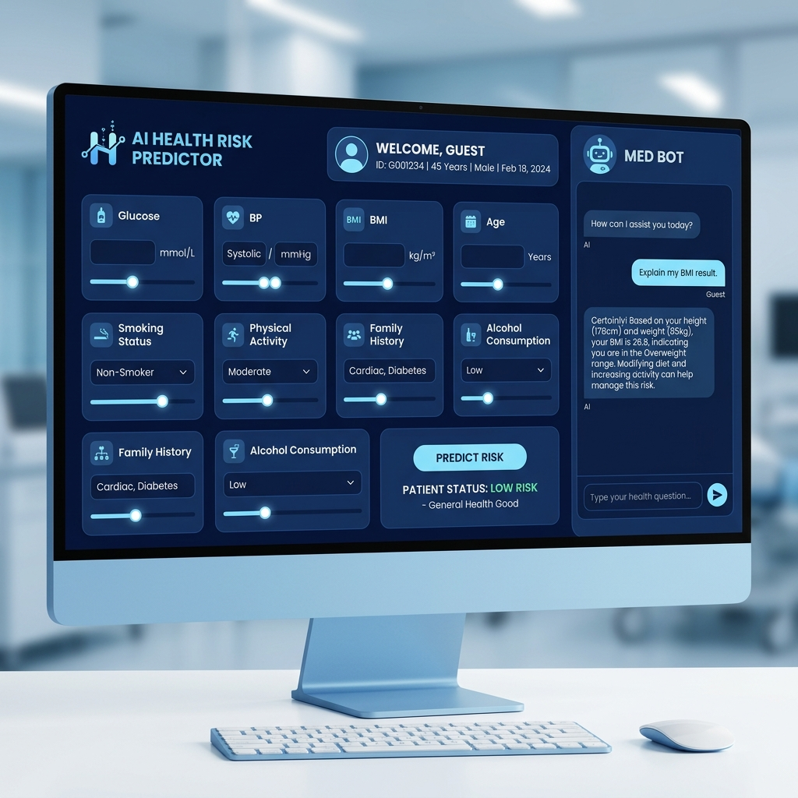
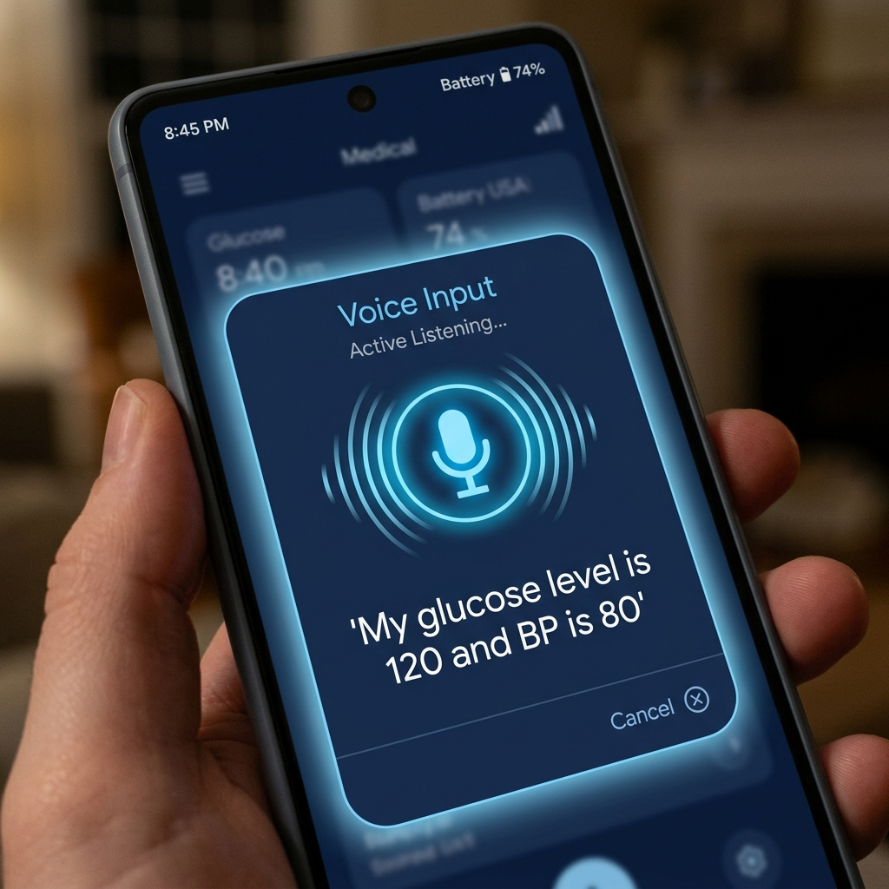
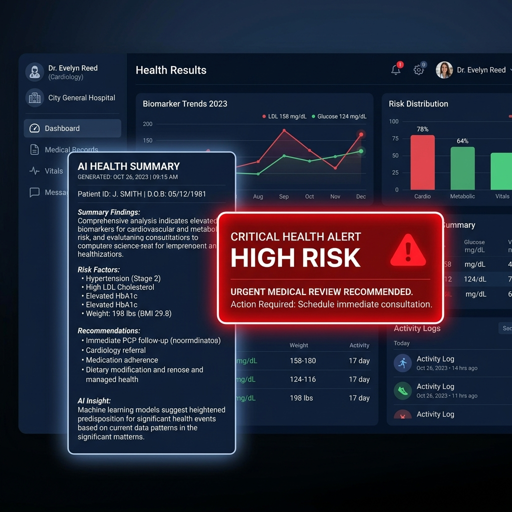

# 🩺 AI Medical Assistant - Health Risk Predictor

A complete AI pipeline project that uses Machine Learning to predict diabetes risk, featuring a Voice Assistant for symptom input and automated AI Health Reporting.

## 🚀 Features
- **ML Prediction:** Analyzes 8 key health metrics to predict diabetes risk using Logistic Regression.
- **🎤 Voice Assistant:** Speak your symptoms and metrics directly into the app for auto-filling.
- **📋 AI Health Report:** Automatically generates a detailed summary and recommendation after each prediction.
- **📊 Interactive Charts:** Visualizes key health metrics (Glucose, BP, BMI) for better impact.
- **💾 Patient History:** Saves all predictions automatically to a CSV file for long-term tracking.

## 📸 Screenshots
*(Add your screenshots here!)*





## 🛠️ Technology Stack
- **Python** (Core Logic)
- **Streamlit** (Frontend Interface)
- **Scikit-learn** (Machine Learning Model)
- **Pandas** (Data Handling)
- **SpeechRecognition** (Voice Processing)

## 🏃 How to Run
1. **Clone the repository:**
   ```bash
   git clone https://github.com/YOUR_USERNAME/AI-Health-Risk-Predictor.git
   ```
2. **Install dependencies:**
   ```bash
   pip install -r requirements.txt
   ```
3. **Run the app:**
   ```bash
   streamlit run app.py
   ```

---
*Created with ❤️ for AI Health Innovation.*
